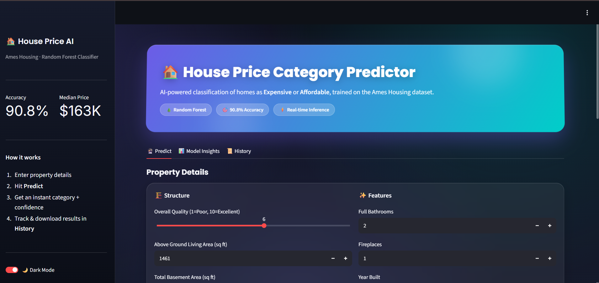
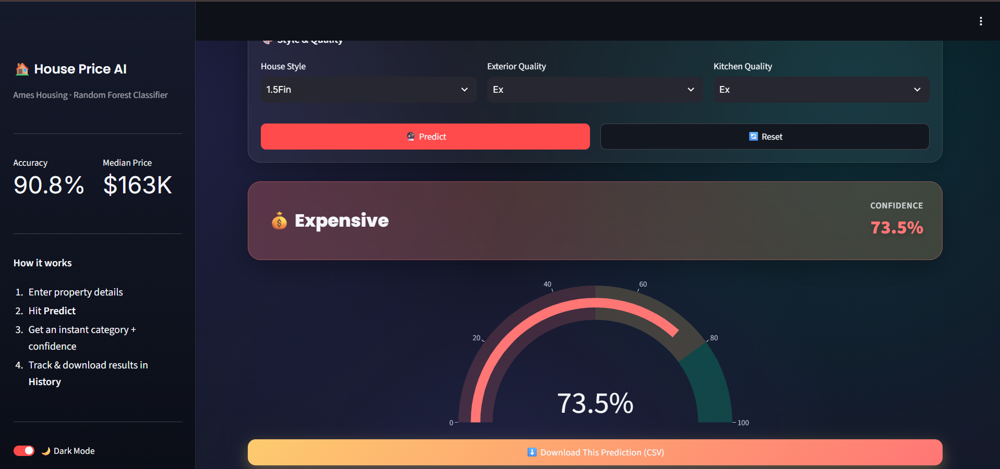
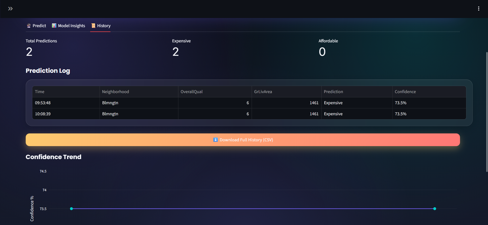

# House Price Category Predictor

A Streamlit web application that predicts whether a house is likely to be **Expensive** or **Affordable** relative to the dataset median, based on key property features.

Built using the Ames Housing dataset as the final deployment task for the **Auspify Technologies Machine Learning/Python internship**.

---

## Project Overview

* **Type:** Binary classification web application
* **Model:** Random Forest Classifier using scikit-learn
* **Framework:** Streamlit
* **Target:** `PriceCategory`

  * `1` = Expensive
  * `0` = Affordable
* **Dataset median:** $163,000
* **Test accuracy:** ~90.75%

The application includes a complete preprocessing and prediction pipeline so that user inputs are processed consistently before being passed to the trained model.

---

## Dataset Description

The project uses the Ames Housing dataset:

* **Dataset:** `Week_3_FINAL_CLEANED.csv`
* **Records:** 1,458
* **Original columns:** 81
* **Features used by the web form:** 13

### Numeric Features

* OverallQual
* GrLivArea
* GarageCars
* TotalBsmtSF
* FullBath
* YearBuilt
* YearRemodAdd
* LotArea
* Fireplaces

### Categorical Features

* Neighborhood
* HouseStyle
* ExterQual
* KitchenQual

Several categorical values such as `Alley` and `PoolQC` use `"None"` to represent the absence of a feature.

---

## Model Description

The application uses a Random Forest classification pipeline:

```text
User Input
    ↓
Data Pre-processing
    ↓
Imputation + Scaling + One-Hot Encoding
    ↓
Random Forest Classifier
    ↓
Prediction + Confidence Score
    ↓
Result Display
```

### Model Configuration

* **Algorithm:** Random Forest Classifier
* **n_estimators:** 200
* **max_depth:** 10
* **min_samples_split:** 5
* **Random state:** 42

The preprocessing and model are saved together in:

```text
house_price_model.pkl
```

Additional model information is stored in:

```text
model_metadata.pkl
```

The metadata contains information such as feature lists, valid categorical options, numeric ranges, median price, and model performance.

---

## Requirements

The required Python packages are listed in `requirements.txt`.

Main dependencies include:

```text
streamlit>=1.30
scikit-learn>=1.6
pandas
joblib
numpy
plotly>=5.18
```

---

## Installation

Clone the repository:

```bash
git clone https://github.com/bilalshaukatt/house-price-prediction-deployment.git
```

Move into the project directory:

```bash
cd house-price-prediction-deployment
```

Install the dependencies:

```bash
pip install -r requirements.txt
```

---

## Running the Application Locally

Start the Streamlit application:

```bash
streamlit run app.py
```

The application will normally be available at:

```text
http://localhost:8501
```

---

## Application Interface

The application contains three main sections:

### 🔮 Predict

Users enter property information such as:

* Overall quality
* Living area
* Garage capacity
* Basement area
* Neighborhood
* House style
* Kitchen quality
* Exterior quality
* Year built
* And other property characteristics

After clicking **Predict**, the application displays:

* Predicted category
* Confidence score
* Visual confidence indicator

### 📊 Model Insights

The application provides an interactive feature-importance visualization showing which features have the greatest influence on the Random Forest model.

### 📜 Prediction History

The application keeps track of predictions made during the current session.

Users can:

* View previous predictions
* Review confidence scores
* View confidence trends
* Export prediction history as CSV

---

## Application Screenshots

### Main Prediction Interface



### Prediction Result



### Prediction History



---

## Using the Application

1. Open the application.
2. Enter the required property information.
3. Click **Predict**.
4. View the predicted category:

   * **Expensive**
   * **Affordable**
5. Review the model confidence score.
6. Use **Reset** to start another prediction.
7. Review previous predictions in the **History** section.
8. Export prediction history as a CSV file if required.

---

## Deployment

The application is deployed using **Railway** with Docker.

### Live Application

https://house-price-prediction-deployment-production.up.railway.app

### GitHub Repository

https://github.com/bilalshaukatt/house-price-prediction-deployment

---

## Bonus Features Implemented

* ✅ Prediction history
* ✅ CSV export
* ✅ Dark mode toggle
* ✅ Interactive feature-importance chart
* ✅ Confidence trend chart
* ✅ Confidence score with progress indicator
* ✅ Sidebar with project information and instructions
* ✅ Input validation
* ✅ Error handling
* ✅ Docker containerization
* ✅ GitHub Actions CI/CD
* ✅ Automated model retraining in CI
* ✅ Prediction smoke test
* ✅ Docker image build validation

---

## Running with Docker

Build the Docker image:

```bash
docker build -t house-price-predictor .
```

Run the container:

```bash
docker run -p 8501:8501 house-price-predictor
```

Then open:

```text
http://localhost:8501
```

---

## Project Structure

```text
house-price-prediction-deployment/
│
├── .github/
│   └── workflows/
│       └── ci.yml
│
├── screenshots/
│   ├── Home.png
│   ├── prediction.png
│   └── History.png
│
├── app.py
├── train_model.py
├── house_price_model.pkl
├── model_metadata.pkl
├── requirements.txt
├── Dockerfile
├── .dockerignore
├── PROJECT_REPORT.md
└── README.md
```

---

## Project Status

| Deliverable             | Status     |
| ----------------------- | ---------- |
| Source Code             | ✅ Complete |
| Trained Model           | ✅ Complete |
| Web Application         | ✅ Complete |
| Live Deployment         | ✅ Complete |
| README                  | ✅ Complete |
| Project Report          | ✅ Complete |
| GitHub Repository       | ✅ Complete |
| Application Screenshots | ✅ Complete |

---

## Author

**Bilal Shaukat**

Computer Science Student
Machine Learning Intern
